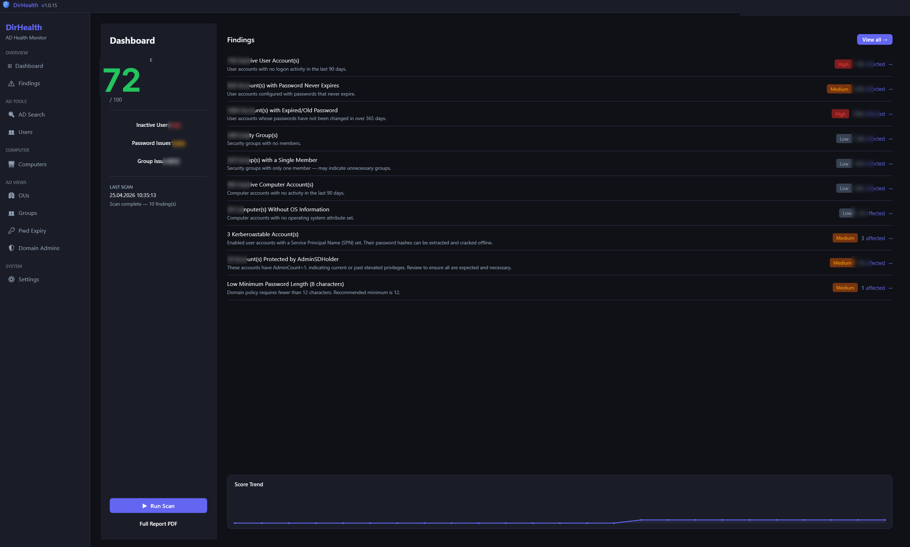

  
  <h1>DirHealth</h1>
  
<strong>Free Active Directory health scanner for Windows admins.</strong> 
  No license key. No subscription. No nag screens.

  
  &nbsp;
  
  &nbsp;
  
  &nbsp;
  

---

---

## What is DirHealth?

DirHealth scans your Active Directory for stale accounts, weak password policies, and security risks — and gives you a clear hygiene score. Built by an admin, for admins.

**Admin-only access:** DirHealth requires domain admin credentials at login. Your AD data stays in the right hands.

**Read-only:** DirHealth never modifies your directory.

## What it checks

| Category | What DirHealth finds |
|---|---|
| 👤 Stale User Accounts | Accounts with no login for 90+ days |
| 🔑 Password Policy Issues | Never-expire, expired, unchanged for 1yr+ |
| 🛡️ Kerberoastable Accounts | SPNs vulnerable to offline password cracking |
| 👥 Group Hygiene | Empty groups and single-member groups |
| 💻 Inactive Computers | Unseen for 90+ days, missing OS info |
| 📋 GPO & AdminSDHolder | Missing password policies, AdminSDHolder anomalies |

Every finding reduces your **Hygiene Score (0–100)**. Fix issues, watch the number climb.

## Getting started

1. **Download** the latest `.exe` from [Releases](https://github.com/matharnica/dirhealth/releases/latest) — single file, no runtime needed
2. **Log in** with your domain admin credentials
3. **Scan & fix** — review findings, drill into categories, export a full PDF report

## Download

→ [**Latest Release**](https://github.com/matharnica/dirhealth/releases/latest)

Requires Windows 10/11. Self-contained .exe — no .NET runtime installation needed.

## Support the project

DirHealth is free and open source, maintained in spare time. If it saved you an afternoon of manual AD cleanup, consider buying a coffee:

→ [**☕ Support on Ko-fi**](https://ko-fi.com/matharnica)  
→ [**💳 Donate via Stripe**](https://donate.stripe.com/8x2aEP30W7So5YR3Gaawo01)

## License

[MIT](LICENSE) — do whatever you want, attribution appreciated.
